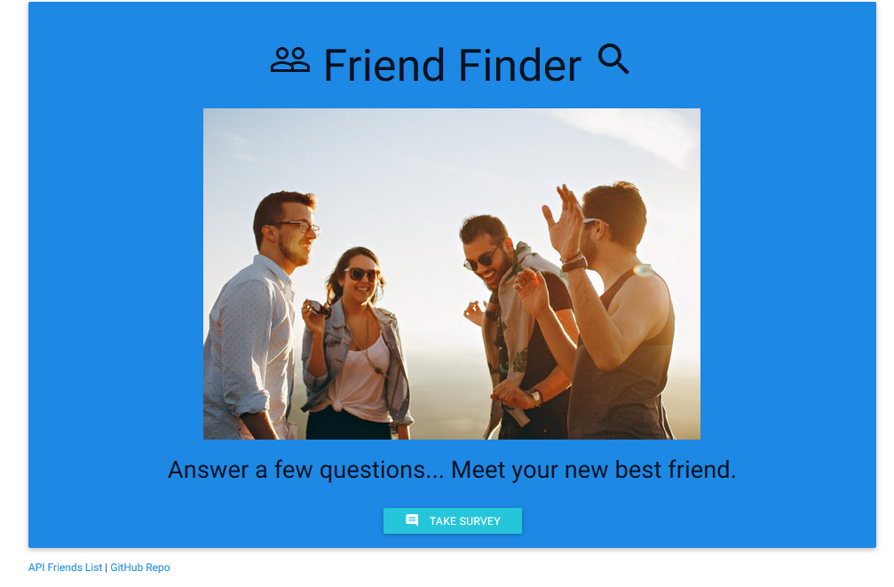
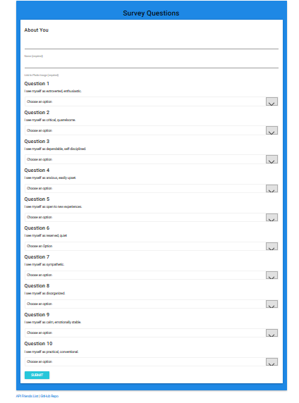

# FriendFinder

In this activity, I needed to build a compatibility-based "FriendFinder" application -- basically a dating app. This full-stack site will take in results from users' surveys, then compare their answers with those from other users. The app will then display the name and picture of the user with the best overall match. 

## Getting Started
https://dry-anchorage-37345.herokuapp.com/

## Screen Shots

Index Page

Survey

## Technologies used
- Node.js
- body-parser NPM Package - https://www.npmjs.com/package/body-parser
- express NPM Package - https://www.npmjs.com/package/express
- path NPM Package - https://www.npmjs.com/package/path

## Authors
* **Jason Goncalves** - *HTML/JS/Node.js* - [Jason Goncalves](https://github.com/JGonc189)

